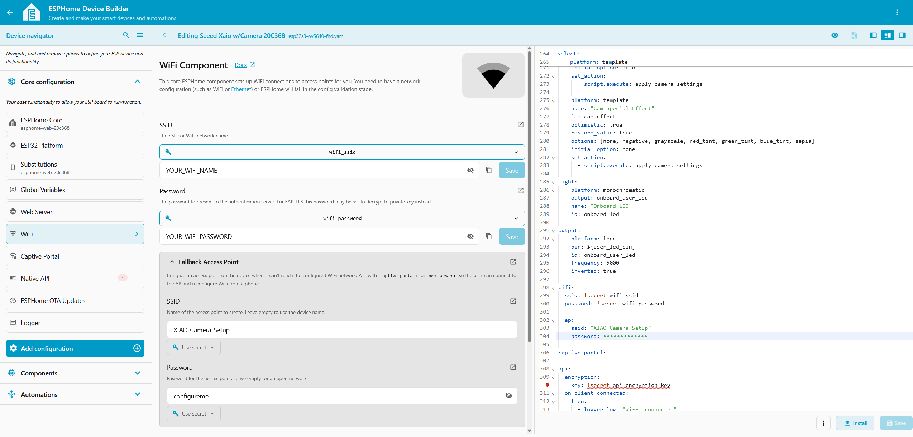
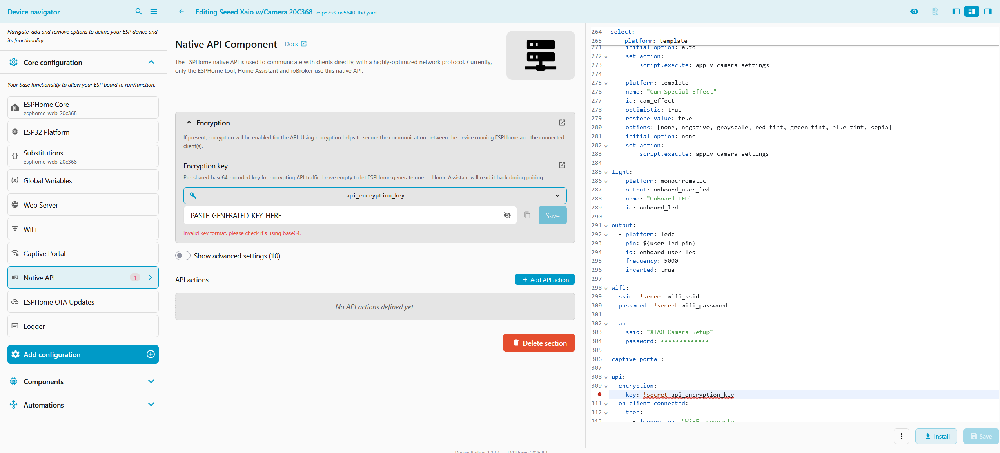
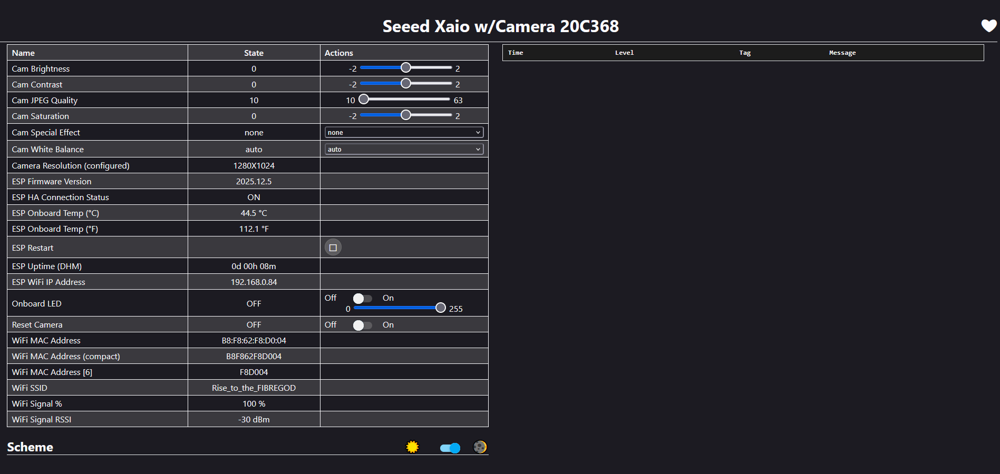
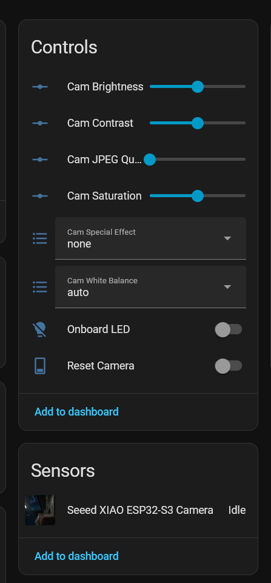
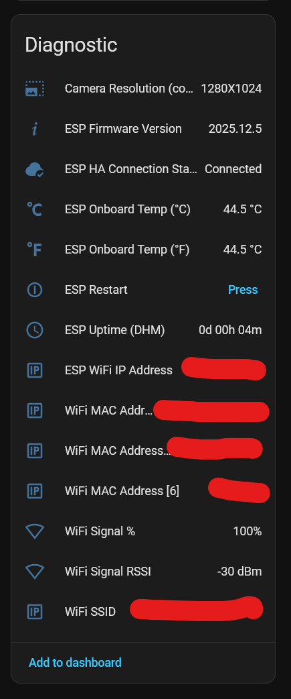

# ESP32 XIAO Sense Camera for ESPHome / Home Assistant

## Overview

This repository contains working ESPHome configurations for the **Seeed Studio XIAO ESP32S3 Sense** camera for use with ESPHome and Home Assistant.

Getting the camera working was quite a bit of trial and error, so this repository is mainly intended as a working reference for others trying to use the XIAO ESP32S3 Sense camera with ESPHome.

Configurations are currently included for:

* OV3660
* OV5640 FHD

The original idea and much of the initial camera configuration came from the Home Assistant Community discussion by **Steve_Campbell**:

https://community.home-assistant.io/t/seeed-xaio-esp32s3-with-ov5640-camera-success/856181/3

User profile:

https://community.home-assistant.io/u/steve_campbell/summary

## Files

The repository contains separate ESPHome YAML configurations for the supported camera sensors.

Depending on your hardware, use either the OV3660 or OV5640 configuration.

A precompiled firmware binary may also be included for easier testing or installation.

## ESPHome Device Builder

The recommended way to use these configurations is through the **ESPHome Device Builder** in Home Assistant.

Copy or import the appropriate YAML configuration into ESPHome Device Builder and configure your own Wi-Fi credentials and API encryption key using ESPHome Secrets.


## ESPHome Secrets

The YAML files use ESPHome's `!secret` functionality for private values such as:

```yaml
wifi_ssid: "YOUR_WIFI_NAME"
wifi_password: "YOUR_WIFI_PASSWORD"
api_encryption_key: "YOUR_API_ENCRYPTION_KEY"
```

These values are stored separately in the ESPHome secrets configuration.

When using ESPHome Device Builder, open the Secrets configuration and define:

```yaml
wifi_ssid: "YOUR_WIFI_NAME"
wifi_password: "YOUR_WIFI_PASSWORD"
api_encryption_key: "YOUR_API_ENCRYPTION_KEY"
```

The main YAML references these values like this:

```yaml
wifi:
  ssid: !secret wifi_ssid
  password: !secret wifi_password

api:
  encryption:
    key: !secret api_encryption_key
```

ESPHome automatically resolves the `!secret` references during compilation.

Enter the values here




The actual Wi-Fi password and API key therefore do not need to be written directly into the public YAML files.

### API encryption key

The API encryption key must be a valid Base64 key.

It can be generated with:

```bash
openssl rand -base64 32
```

Copy the generated value into the ESPHome Secrets configuration:

```yaml
api_encryption_key: "PASTE_GENERATED_KEY_HERE"
```

## Wi-Fi Setup / Fallback Access Point

The configuration also provides a fallback Wi-Fi access point:

```yaml
wifi:
  ap:
    ssid: "XIAO-Camera-Setup"
    password: "configureme"

captive_portal:
```

If the ESP32 cannot connect to the configured Wi-Fi network, it will create its own Wi-Fi network:

**SSID:** `XIAO-Camera-Setup`

**Password:** `configureme`

Connect a phone or computer to this network.

The ESPHome captive portal should normally open automatically.

If it does not, open:

```text
http://192.168.4.1
```

The actual Wi-Fi SSID and password can then be entered through the captive portal.

The fallback AP credentials are intentionally public because they are only used for initial device provisioning.

## Compiling

After importing the YAML into ESPHome Device Builder and configuring the required secrets, select:

**Install**

ESPHome will validate the configuration and compile the firmware.

If direct installation is not possible, ESPHome Device Builder also allows the compiled firmware to be downloaded and flashed manually.

If ESPHome is installed locally, the configuration can alternatively be compiled from the command line:

```bash
esphome compile YOUR_CONFIG.yaml
```

## Home Assistant

After the ESP32 successfully connects to your Wi-Fi network, Home Assistant should be able to discover the ESPHome device.

When Home Assistant asks for the ESPHome API encryption key, use the same key stored as:

```yaml
api_encryption_key:
```

in your ESPHome Secrets configuration.

## Camera Settings

Several camera parameters are exposed through ESPHome and Home Assistant, including settings such as:

* Brightness
* Contrast
* Saturation
* White balance
* Special effects

### Changing Values

Currently, changed camera values only take effect after restarting the ESP32.

## ESPHome UI



## Home Assistant UI





## Compatibility

The configurations are currently intended for the **Seeed Studio XIAO ESP32S3 Sense** with:

* OV3660
* OV5640

Other compatible ESP32 camera sensors may also work, but have not necessarily been tested.

## Notes

This project was developed largely through experimentation and trial and error.

If you find corrections, compatibility improvements, cleaner implementations, or settings that work better with other XIAO ESP32S3 Sense camera modules, issues and pull requests are welcome.
